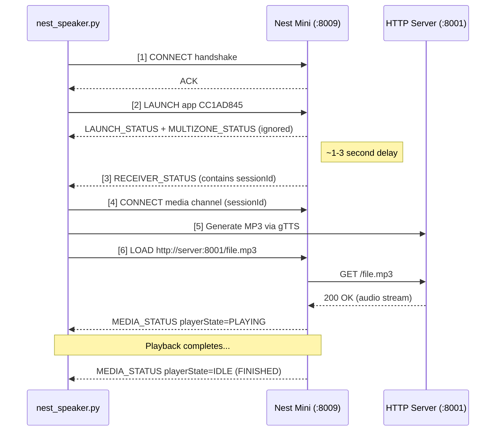

# NestSpeaker

Make your Google Nest Mini or Chromecast speak any text you want. No Google account, no cloud API, no Google auth required.

```bash
python3 nest_speaker.py "Hello from the Nest!"
```

---

## What It Does

This script speaks the Google Cast protocol directly to your Nest device, generates speech audio using Google's free text-to-speech service (gTTS), and streams it over your local network. Use it for notifications, automation triggers, home assistant announcements — or just as a fun way to make your Nest say whatever you want.

## Quick Start (5 minutes)

### 1. Find your Nest's IP address

Check your router's admin page or run `arp -a` to find it. You need the IP of your Nest Mini or Chromecast.

### 2. Install dependencies

```bash
pip3 install pychromecast gTTS
```

**Note:** `pychromecast` is only used for its protobuf message definitions. This script does not use the `pychromecast` connection code at all.

### 3. Open the firewall port

The script spins up a tiny HTTP server to deliver the audio file to your Nest. Your Nest needs to reach it:

```bash
# Linux (firewalld)
sudo firewall-cmd --zone=public --add-port=8001/tcp --permanent
sudo firewall-cmd --reload

# macOS (skip — no firewall by default)

# Windows (PowerShell, Administrator)
New-NetFirewallRule -DisplayName "NestSpeaker HTTP" -Direction Inbound -LocalPort 8001 -Protocol TCP -Action Allow
```

### 4. Run it

```bash
# --ip auto-detects your server IP if you're on the same network
python3 nest_speaker.py --ip 10.10.1.50 "Your Nest is alive!"

# Different port
python3 nest_speaker.py --ip 10.10.1.50 --server-port 9000 "Custom port works too"
```

## How It Works (Simplified)

```
 ┌─────────────┐   Cast v2 protocol    ┌──────────┐     audio file
 │  Your PC    │ ◄─── port 8009/TLS ──►│  Nest    │ ◄──────────────
 │             │ ◄─── port 8001/HTTP ──│  Mini    │              │
 │nest_speaker │                       │          │              │
 └─────────────┘                       └──────────┘              │
     ▲                                                            │
     └── generates MP3 via gTTS, serves it ───────────────────────┘
```

**Step by step:**

```
 1. Your script connects to the Nest on port 8009 (secure TLS)
        │
 2. Tells the Nest to launch the Default Media Receiver app (CC1AD845)
        │
 3. Nest says "OK, ready" — script launches a tiny HTTP server on :8001
        │
 4. Your text becomes an MP3 via gTTS, saved to /tmp/
        │
 5. Script tells the Nest to play http://your-ip:8001/file.mp3
        │
 6. Nest downloads the MP3 directly from your PC's HTTP server and plays it
        │
 7. MP3 is cleaned up after playback
```

### How the Cast Protocol Works

For the curious — what happens on the TLS socket:



## Why the Local HTTP Server?

The Google Cast protocol doesn't support streaming audio directly over the Cast socket. You give the Nest a **URL** and it downloads the audio itself. The script includes a lightweight HTTP server to serve the generated MP3 files from `/tmp/`. No nginx, Apache, or external web server needed — it's built in.

## Command-Line Options

| Flag | Purpose | Default |
|---|---|---|
| `--ip` | IP of your Nest Mini or Chromecast | `10.10.100.122` |
| `--server-ip` | IP the Nest uses to download audio (auto-detected if omitted) | auto-detect |
| `--server-port` | Port for the built-in HTTP server | `8001` |

**Auto-detect:** If you omit `--server-ip`, the script probes which network interface routes to your Nest and uses that interface's IP. Works if your PC and Nest are on the same network.

## Troubleshooting

**"Launch failed — no sessionId from RECEIVER_STATUS"**

The Nest didn't respond to LAUNCH. Check:
- Correct IP address for your Nest
- Port 8009/TCP is not blocked on the Nest (rare)
- Nest is on the same subnet as your PC

**"playerState: IDLE" never becomes "PLAYING"**

The Nest can't reach your HTTP server. Common causes:
- Your server IP is wrong → specify it with `--server-ip`
- Firewall blocking port 8001 → open it (see step 3 above)
- Different subnets with no route between them

**"idleReason: ERROR" in the output**

The MP3 URL was unreachable or unsupported content type. This usually means your server IP is wrong.

**"BrokenPipeError" in the HTTP server logs**

Normal. The Nest buffers the MP3 and closes the connection early. Not a problem.

**"CONNECT received CLOSE response"**

Handshake failed. May happen with outdated firmware. Try updating via the Google Home app.

## Firmware Compatibility

| Firmware | Status | Notes |
|---|---|---|
| Google Assistant (legacy) | Works | Original firmware |
| Gemini for Home (2026+) | Works | Handles delayed session ID (~1-3s) automatically |

The script works with both. Gemini devices add a 1-3 second delay before returning the session ID — the script waits up to 8 seconds to be safe.

## Files

| File | Purpose |
|---|---|
| `nest_speaker.py` | Main script — Cast v2 handshake, TTS, media playback |
| `nest_debug.py` | Wire-level diagnostic — raw protocol probes and hex dumps for debugging |

## FAQ

**Does this require a Google account?**
No. gTTS uses Google's public TTS API (no auth). Cast is a local network protocol (no cloud).

**Can it speak in other languages?**
Yes. Edit `gTTS(text, lang="en")` in `nest_speaker.py` — for example `lang="es"` for Spanish.

**Why not use Google Assistant's built-in TTS?**
Assistant requires account auth and routes through Google's cloud. This gives you raw, local control — useful for automation, IoT triggers, and notification systems.

**Is this safe? Will it brick my Nest?**
The Cast protocol is officially supported — YouTube and Netflix use it too. No bricking risk.

**What if port 8001 is already in use?**
Use `--server-port <port>`. Remember to open that port in your firewall if you change it.
