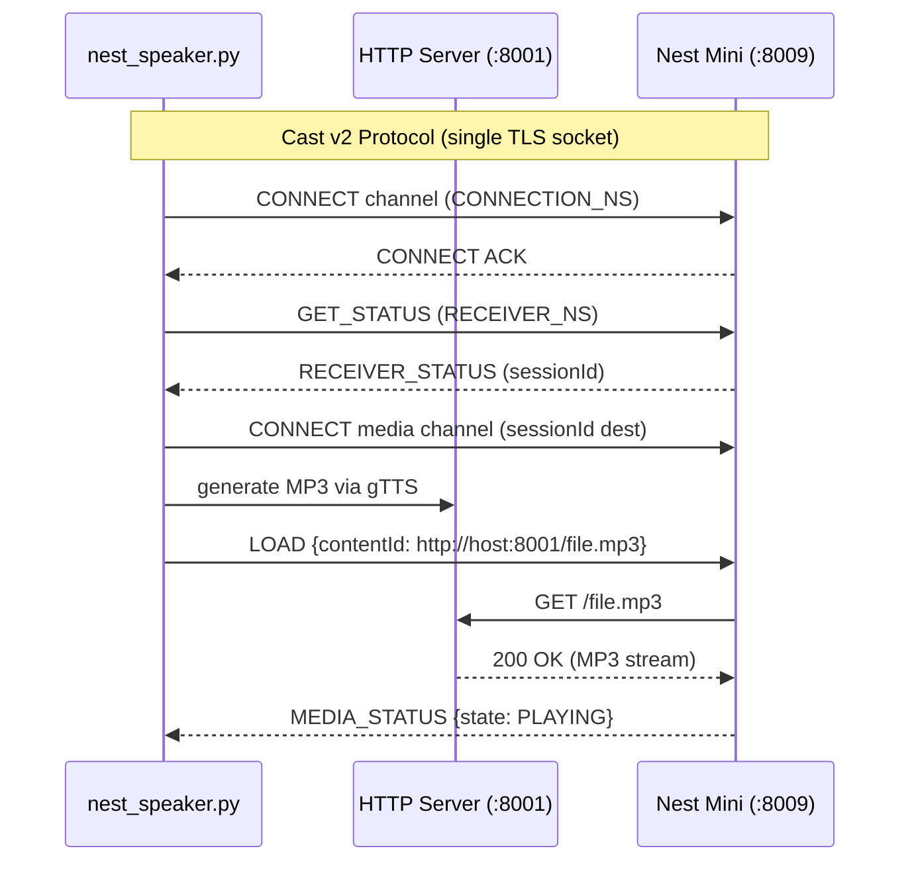

# NestSpeaker

Send text-to-speech audio to a Google Nest Mini or Chromecast by speaking the Cast v2 protocol directly over TLS. No Google account, no mDNS discovery, no cloud API required.

```
python3 nest_speaker.py "Hello from the Nest!"
```

## Usage

```
python3 nest_speaker.py "Your message here" [OPTIONS]

  --ip          Nest/Chromecast IP  (default: 10.10.100.122)
  --server-ip   Host IP for file serving (default: 10.10.0.100)
  --server-port HTTP server port   (default: 8001)
```

## Requirements

- Python 3.9+
- `pip install pychromecast gTTS` (pychromecast used only for the `CastMessage` protobuf definition)
- Firewall: port 8001/tcp must be open so the Nest can reach the local HTTP server:
  ```bash
  sudo firewall-cmd --zone=public --add-port=8001/tcp --permanent
  sudo firewall-cmd --reload
  ```

## Architecture



## Protocol Details

All messages travel over a single TLS socket on port 8009. Each frame is:

```
[4 bytes BE length][CastMessage protobuf]
```

The protobuf envelope carries `source_id`, `destination_id`, `namespace`, and a JSON string payload. Request correlation (`requestId`) lives **inside the JSON**, not as a protobuf field.

### Session Flow

| Step | Action | Namespace | Result |
|--|--|--|--|
| 1 | `CONNECT` channel | `CONNECTION_NS` | Opens receiver-0 channel |
| 2 | `GET_STATUS` | `RECEIVER_NS` | Lists running apps + sessionId |
| 3 | `LAUNCH` app `CC1AD845` | `RECEIVER_NS` | Launches Media Receiver if needed |
| 4 | `CONNECT` media channel | `CONNECTION_NS` | Opens sessionId-scoped channel |
| 5 | `LOAD` with audio URL | `MEDIA_NS` | Triggers playback with autoplay |
| 6 | Wait for `MEDIA_STATUS` | `MEDIA_NS` | Confirms `playerState: PLAYING` |

### gTTS + HTTP Server

A background `SimpleHTTPRequestHandler` serves `/tmp/` on port 8001. Each message generates a timestamped MP3 via gTTS, and the LOAD command points the Nest at `http://<server-ip>:8001/nest_tts_<timestamp>.mp3`.

## Troubleshooting

| Symptom | Fix |
|--|--|
| `CLOSE` on every message | Wrong handshake — use `CONNECT` in `CONNECTION_NS`, not `MAIN_NS` |
| `playerState: IDLE` never becomes PLAYING | Nest can't reach the MP3 — check firewall, server IP |
| `BrokenPipeError` in HTTP logs | Normal — Nest buffers audio and closes early |
| `idleReason: ERROR` | Check `errorId` — usually a bad URL or unsupported content type |
| Timeout before audio plays | Long messages create large MP3s — increase script timeout |

## Files

| File | Purpose |
|--|--|
| `nest_speaker.py` | Main player — full Cast v2 handshake, media load, playback confirmation |
| `nest_debug.py` | Wire-level diagnostic — prints raw protobuf hex for protocol analysis |

## Lessons Learned

1. **protobuf fields are strict** — injecting `requestId` as raw protobuf field 10 corrupted frames. It belongs in the JSON payload only.
2. **`CONNECT` must go in `CONNECTION_NS`** — sending it in `MAIN_NS` gets instant CLOSE.
3. **Nest Mini = Chromecast on the wire** — same Cast v2 protocol, same `CC1AD845` Media Receiver, same port 8009 TLS.
4. **Firewall rules matter** — the Cast socket works without changes, but the Nest needs outbound access to the HTTP server port for audio delivery.
